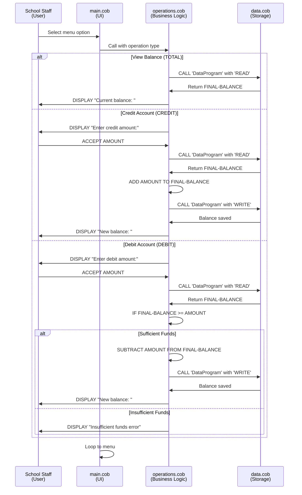
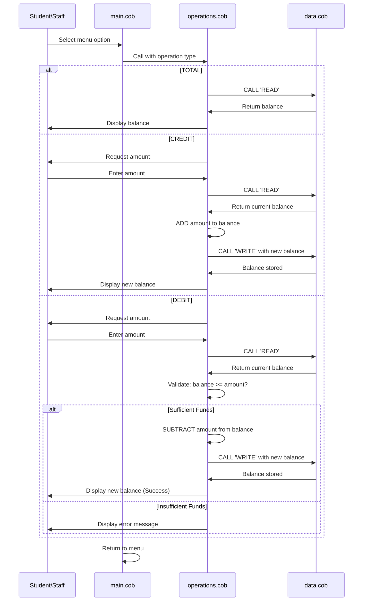
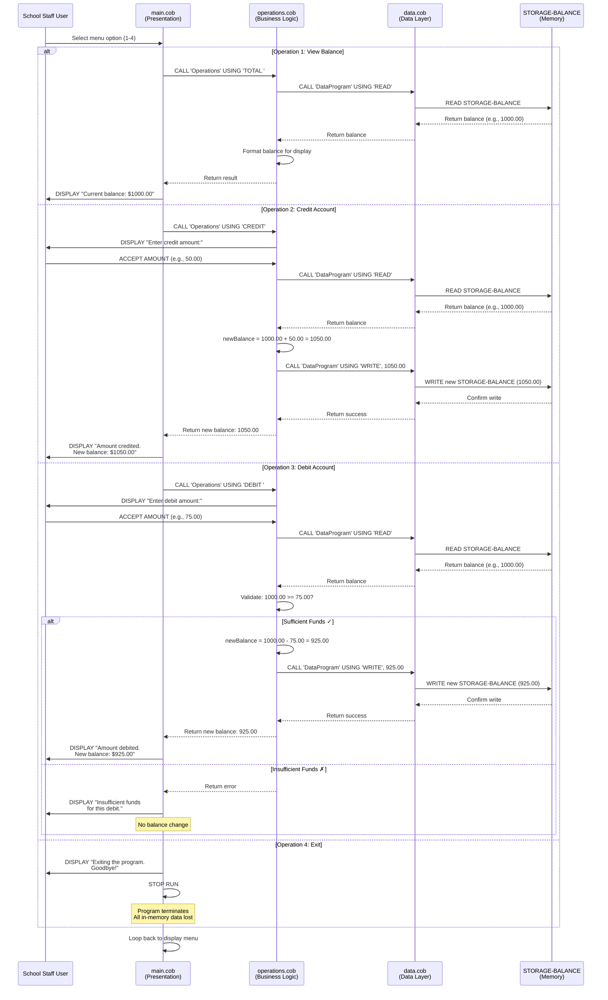

# School Accounting System - Legacy COBOL Documentation

## System Overview

This document describes the legacy COBOL-based accounting system used by Mergington High School to manage student accounts. The system has been in continuous operation since the early 1990s and handles critical financial operations including:
- Student fee management
- Cafeteria account credits and debits
- School supplies purchases
- Account balance tracking

---

## Architecture Overview

The system follows a **three-tier architectural pattern**, separating concerns between presentation, business logic, and data persistence:

```
┌──────────────────────────────────────┐
│  Presentation Layer                  │
│  (main.cob - MainProgram)            │
│  User Interface & Menu System        │
└────────────────┬─────────────────────┘
                 │ Calls
┌────────────────▼─────────────────────┐
│  Business Logic Layer                │
│  (operations.cob - Operations)       │
│  Transaction Processing & Validation │
└────────────────┬─────────────────────┘
                 │ Calls
┌────────────────▼─────────────────────┐
│  Data Persistence Layer              │
│  (data.cob - DataProgram)            │
│  Account Balance Storage & Retrieval  │
└──────────────────────────────────────┘
```

---

## COBOL Files Detailed Analysis

### 1. **main.cob** - MainProgram (Presentation Layer)

**Purpose:** Provides the user interface and menu system for school staff to interact with student accounts.

**Key Responsibilities:**
- Display an interactive menu with account operations
- Accept user input for menu selection
- Delegate operations to the Operations module
- Maintain continuous program execution (loop until exit)

**Menu Options:**
| Option | Operation | Description |
|--------|-----------|-------------|
| 1 | View Balance | Display current student account balance |
| 2 | Credit Account | Add funds to account (e.g., tuition payment received) |
| 3 | Debit Account | Withdraw funds from account (e.g., cafeteria charge, supply purchase) |
| 4 | Exit | Terminate the program |

**Key Implementation Details:**
- Uses `PERFORM UNTIL CONTINUE-FLAG = 'NO'` for the main loop
- Uses `EVALUATE` statement for menu choice routing
- Passes operation type strings to Operations:
  - `'TOTAL '` → View balance
  - `'CREDIT'` → Add funds
  - `'DEBIT '` → Withdraw funds

**Code Flow:**
```
1. Display menu options
2. Accept user choice
3. Route to appropriate operation
4. Call Operations program with operation type
5. Repeat until user selects "Exit"
```

---

### 2. **operations.cob** - Operations (Business Logic Layer)

**Purpose:** Contains all business logic, transaction processing, and validation rules.

**Key Operations:**

#### Operation: TOTAL (View Balance)
```
Action: Display current account balance
Steps:
  1. Call DataProgram with 'READ' operation
  2. Receive current balance
  3. Display balance to user
```

#### Operation: CREDIT (Add Funds)
```
Action: Add money to the account
Steps:
  1. Prompt user for credit amount
  2. Call DataProgram with 'READ' to get current balance
  3. Calculate new balance = current balance + amount
  4. Call DataProgram with 'WRITE' to save new balance
  5. Display confirmation with new balance
```

#### Operation: DEBIT (Withdraw Funds)
```
Action: Subtract money from the account
Steps:
  1. Prompt user for debit amount
  2. Call DataProgram with 'READ' to get current balance
  3. VALIDATE: Is balance >= requested amount?
     ✓ YES → Calculate new balance = current balance - amount
            → Call DataProgram with 'WRITE' 
            → Display confirmation with new balance
     ✗ NO  → Display "Insufficient funds for this debit." error
            → Reject transaction, no changes made
```

**Critical Business Rules:**
- ✅ **Overdraft Prevention** - The system will NOT allow a debit transaction if the resulting balance would be negative
- ✅ **Fund Validation** - Each debit is validated against available funds before processing
- ✅ **Immediate Persistence** - All balance changes are immediately written to storage

**Data Variables:**
- `OPERATION-TYPE` (PIC X(6)) - Type of operation being performed
- `AMOUNT` (PIC 9(6)V99) - Transaction amount with cents precision
- `FINAL-BALANCE` (PIC 9(6)V99) - Current account balance

---

### 3. **data.cob** - DataProgram (Data Persistence Layer)

**Purpose:** Manages all account balance storage and retrieval operations.

**Key Operations:**

#### Operation: READ
- **Function:** Retrieve current account balance
- **Input Parameter:** Operation type = 'READ'
- **Output:** Returns current `STORAGE-BALANCE`
- **Used By:** Operations module to check balances before transactions

#### Operation: WRITE
- **Function:** Save updated account balance
- **Input Parameter:** New balance value
- **Action:** Updates `STORAGE-BALANCE` with new value
- **Used By:** Operations module after credit/debit calculations

**Persistent Storage:**
- `STORAGE-BALANCE` (PIC 9(6)V99) - Initial: 1000.00
  - Represents the student account balance in dollars and cents
  - Persists across all operations within a program session
  - Format: Up to 999999.99 (6 digits + 2 decimal places)
  - In-memory storage (lost when program exits)

---

## Data Flow Diagram



---

## Business Requirements

### Functional Requirements (Currently Implemented)

| Requirement | Status | Component |
|-----------|--------|-----------|
| View current account balance | ✅ Implemented | main.cob → operations.cob (TOTAL) → data.cob (READ) |
| Add funds to account | ✅ Implemented | main.cob → operations.cob (CREDIT) → data.cob (READ/WRITE) |
| Withdraw funds from account | ✅ Implemented | main.cob → operations.cob (DEBIT) → data.cob (READ/WRITE) |
| **Prevent overdrafts** | ✅ Implemented | operations.cob validates balance before debit |
| Persistent balance storage | ✅ Implemented | data.cob maintains STORAGE-BALANCE |
| User-friendly menu interface | ✅ Implemented | main.cob displays clear prompts and options |
| Decimal precision (cents) | ✅ Implemented | PIC 9(6)V99 format for all amounts |

### Non-Functional Characteristics

| Characteristic | Current Implementation |
|---|---|
| **Data Scope** | Single account only (hardcoded balance = 1000.00) |
| **Storage Type** | In-memory (temporary - data lost when program exits) |
| **User Authentication** | None - no login or access control |
| **Audit Trail** | None - no transaction history or logging |
| **Interface** | Command-line text interface |
| **Scalability** | Limited to single account |
| **System Integration** | Standalone - no API or external system integration |
| **Runtime Environment** | Requires COBOL compiler/interpreter |

---

## Key Business Rules

### Rule 1: Overdraft Protection (CRITICAL)
**Rule:** A debit transaction is rejected if the resulting balance would be negative.

**Implementation Location:** `operations.cob` - DEBIT operation
```cobol
IF FINAL-BALANCE >= AMOUNT
    SUBTRACT AMOUNT FROM FINAL-BALANCE
    CALL 'DataProgram' USING 'WRITE', FINAL-BALANCE
    DISPLAY "Amount debited. New balance: " FINAL-BALANCE
ELSE
    DISPLAY "Insufficient funds for this debit."
END-IF
```

**Business Impact:** Protects the school from student accounts going into negative balance. This is a fundamental financial control that must be preserved during modernization.

### Rule 2: Immediate Persistence
**Rule:** All balance updates are immediately written to storage after each transaction.

**Business Impact:** Ensures data consistency and prevents loss of transaction data within a program session.

### Rule 3: Precision in Currency
**Rule:** All monetary amounts are tracked with two decimal places (cents).

**Implementation:** `PIC 9(6)V99` format for all monetary fields
- Supports amounts from 0.00 to 999999.99

---

## Modernization Considerations

### Strengths of Current System
✅ Clear separation of concerns (three-tier architecture)  
✅ Sound core business logic (overdraft protection)  
✅ Simple and deterministic behavior  
✅ Reliable for controlled operations  

### Challenges for Modernization
❌ **Single Account Limitation** - Cannot manage multiple student accounts  
❌ **No Data Persistence** - In-memory storage lost on exit  
❌ **No Authentication** - Anyone can access and modify accounts  
❌ **No Audit Trail** - No transaction history or accountability  
❌ **Maintenance Burden** - Decreasing COBOL expertise in IT workforce  
❌ **Integration Issues** - Cannot easily connect with modern school systems  
❌ **Limited Scalability** - Not designed for enterprise use  

### Recommended Modernization Improvements
1. Translate to **Node.js** with a REST API architecture
2. Implement **database persistence** (replace in-memory storage)
3. Support **multiple student accounts** with unique identifiers
4. Add **user authentication and authorization**
5. Create **comprehensive audit logging** for compliance
6. Build a **web-based or mobile interface**
7. Enable **integration with other school systems** (SIS, payroll, etc.)
8. Implement **error handling and recovery** mechanisms
9. Add **rate limiting and usage analytics**

---

## Summary

The Mergington High School accounting system is a well-structured legacy application that reliably manages student account balances. Its modular three-tier design provides an excellent foundation for understanding business requirements during modernization. The critical business rule—**overdraft protection**—must be preserved and replicated in any modern implementation. The clear separation between presentation, business logic, and data layers demonstrates good architectural design principles that remain valid in contemporary systems.
# School Accounting System - Legacy COBOL Documentation

## Overview

This document describes the legacy COBOL-based accounting system used by Mergington High School to manage student accounts, including fees, cafeteria credits, and supply purchases. The system has been in operation since the early 1990s and is responsible for critical financial operations.

---

## System Architecture

The application follows a **three-tier architectural pattern**:

```
┌─────────────────────────────────┐
│   Presentation Layer            │
│   (main.cob)                     │
│   - User Interface & Menu        │
└────────────┬────────────────────┘
             │
┌────────────▼────────────────────┐
│   Business Logic Layer          │
│   (operations.cob)               │
│   - Transaction Processing      │
│   - Validation & Rules          │
└────────────┬────────────────────┘
             │
┌────────────▼────────────────────┐
│   Data Persistence Layer        │
│   (data.cob)                     │
│   - Storage Management          │
│   - Account Balance              │
└─────────────────────────────────┘
```

---

## File Details

### 1. **main.cob** (MainProgram) - Presentation Layer

**Purpose:** User interface and menu system for school staff to interact with the accounting system.

**Key Functions:**
- Display interactive menu with 4 options
- Accept user input (menu choices)
- Delegate operations to the Operations module
- Maintain continuous program execution until exit is selected

**Menu Options:**
```
1. View Balance        → Display current account balance
2. Credit Account      → Add funds (e.g., tuition payment received)
3. Debit Account       → Remove funds (e.g., cafeteria purchase, supply order)
4. Exit                → Terminate the program
```

**Implementation Details:**
- Uses `PERFORM UNTIL CONTINUE-FLAG = 'NO'` loop for continuous operation
- Validates menu choices with `EVALUATE` statement
- Passes operation type strings to Operations program:
  - `'TOTAL '` for balance viewing
  - `'CREDIT'` for credit operations
  - `'DEBIT '` for debit operations

---

### 2. **operations.cob** (Operations) - Business Logic Layer

**Purpose:** Contains all business logic, transaction processing, and validation rules.

**Key Functions:**

#### View Balance (TOTAL)
```
1. Call DataProgram to READ current balance
2. Display the balance to user
```

#### Credit Account (CREDIT)
```
1. Prompt user for credit amount
2. Call DataProgram to READ current balance
3. Add amount to balance
4. Call DataProgram to WRITE updated balance
5. Display new balance confirmation
```

#### Debit Account (DEBIT)
```
1. Prompt user for debit amount
2. Call DataProgram to READ current balance
3. CHECK if balance >= amount (CRITICAL VALIDATION)
   - If YES: Subtract amount → Write to storage → Display confirmation
   - If NO: Display "Insufficient funds" error → Transaction rejected
```

**Critical Business Rule:**
The system **prevents overdrafts** - you cannot debit more funds than are available in the account. This is a fundamental financial control.

**Data Variables:**
- `OPERATION-TYPE` - Type of operation being performed
- `AMOUNT` - Transaction amount (numeric with 2 decimal places)
- `FINAL-BALANCE` - Current account balance

---

### 3. **data.cob** (DataProgram) - Data Persistence Layer

**Purpose:** Manages all account balance storage and retrieval.

**Key Functions:**

#### READ Operation
- Returns the current balance to the calling program
- Retrieves from `STORAGE-BALANCE`

#### WRITE Operation
- Stores the updated balance to persistent storage
- Updates `STORAGE-BALANCE` with new value

**Persistent Data:**
- `STORAGE-BALANCE` - Initial value: 1000.00
  - Represents the student account balance
  - Persists across operations within the program session
  - Format: 6 digits + 2 decimal places (999999.99)

---

## Business Requirements

### Functional Requirements

| Requirement | Status | Implementation |
|-------------|--------|-----------------|
| View current account balance | ✅ Implemented | `main.cob` option 1 → `operations.cob` TOTAL operation |
| Add funds to account | ✅ Implemented | `main.cob` option 2 → `operations.cob` CREDIT operation |
| Withdraw funds from account | ✅ Implemented | `main.cob` option 3 → `operations.cob` DEBIT operation |
| Prevent overdrafts | ✅ Implemented | Validation in `operations.cob` prevents debit if insufficient funds |
| Persistent account balance | ✅ Implemented | `data.cob` STORAGE-BALANCE maintains state |
| User-friendly menu interface | ✅ Implemented | `main.cob` displays clear options and prompts |

### Non-Functional Requirements

| Requirement | Current State |
|------------|---------------|
| Single Student Account | Only one hardcoded account (balance = 1000.00) |
| In-Memory Storage | Temporary storage (data lost when program exits) |
| No Authentication | No user login or role-based access control |
| No Audit Trail | No transaction logging or history |
| Command-Line Interface | Text-based terminal interface only |
| COBOL Runtime Required | Must run on COBOL compiler/interpreter |

---

## Data Flow Diagram



---

## Key Observations for Modernization

### Strengths
- ✅ Clear three-tier separation of concerns
- ✅ Core business logic is sound (overdraft protection)
- ✅ Simple and deterministic behavior
- ✅ Reliable for single-user operations

### Limitations & Modernization Opportunities
- ❌ **Single Account Only** - No support for multiple student accounts
- ❌ **No Data Persistence** - Data lost when program exits
- ❌ **No Authentication** - No user authentication or authorization
- ❌ **No Audit Trail** - No transaction history or logging
- ❌ **Hard to Maintain** - Few developers know COBOL
- ❌ **Limited Integration** - Cannot easily interface with modern systems
- ❌ **No Scalability** - In-memory storage limits capacity

### Modernization Goals
1. Translate to **Node.js** with a REST API
2. Implement **database persistence** (replace in-memory storage)
3. Support **multiple student accounts**
4. Add **user authentication** (staff logins)
5. Create **audit logging** for all transactions
6. Build a **web or mobile UI** (replace CLI)
7. Enable **API integration** with other school systems

---

## Summary

The Mergington High School accounting system is a well-structured legacy application that reliably manages student account balances. Its modular three-tier design provides a solid foundation for modernization to Node.js. The core business logic—particularly the overdraft protection mechanism—must be preserved and replicated during the migration process.

---

## Complete Data Flow Sequence Diagram

This sequence diagram illustrates the complete data flow through all three tiers of the application for each type of operation:



### Key Data Flow Observations

1. **Request Flow (Top-Down)**: All requests flow from the user through presentation → business logic → data layer
2. **Response Flow (Bottom-Up)**: All responses flow back from data layer → business logic → presentation → user
3. **Data Validation**: The Operations layer validates all requests before accessing the data layer
4. **Immediate Persistence**: Every write operation immediately updates STORAGE-BALANCE
5. **Read-Validate-Write Pattern**: Debit operations follow this secure pattern to prevent race conditions
6. **Error Handling**: Invalid operations are caught at the Operations layer before data access

### Critical Data Integrity Points

- **Balance Consistency**: STORAGE-BALANCE is the single source of truth
- **Overdraft Protection**: Validated in Operations layer before calling Data layer
- **Transaction Atomicity**: Each operation is atomic (all-or-nothing)
- **No Intermediate States**: The balance is never in an invalid state between reads and writes
